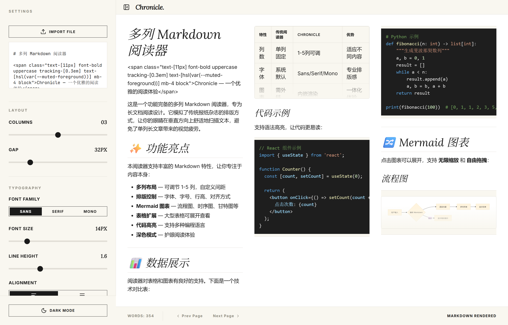
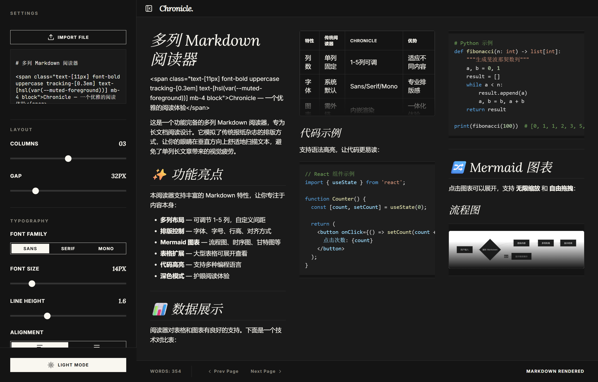
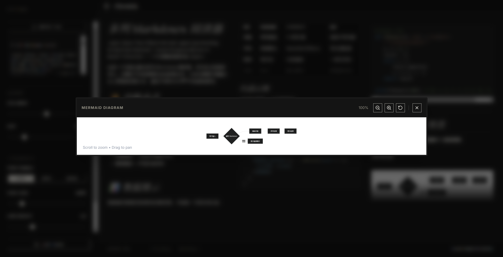

# Multi-Column Markdown Reader

<div align="center">

一个功能完备的多列 Markdown 阅读器，支持高度自定义的排版和响应式阅读体验。

</div>

<div align="center">
  
  
</div>

<div align="center">
  <em>浅色模式 & 深色模式</em>
</div>

---

## 功能特性

### 📰 多列布局
- 可调节列数 (1-5列)
- 自定义列间距 (16-96px)
- 水平滚动阅读，模拟报纸阅读体验
- 翻页导航按钮

### 🎨 排版控制
- **字体**: Sans / Serif / Mono 三种风格
- **字号**: 12px - 24px 可调
- **行高**: 1.2 - 2.5 可调
- **对齐**: 左对齐 / 两端对齐

### 📊 Mermaid 图表支持
- 渲染流程图、时序图、甘特图等
- **无限缩放**: 10% - 1000% (滚轮缩放)
- **自由拖拽**: 鼠标拖动平移
- 缩放控制按钮 + 重置功能

<div align="center">
  
</div>

### 📋 表格扩展
- 预览模式限制高度
- 点击展开全屏查看
- 滚动浏览大型表格

### 🌓 其他特性
- Dark / Light 模式切换
- 导入本地 `.md` / `.txt` 文件
- 直接粘贴 Markdown 内容
- 代码语法高亮 (Prism)
- GFM 支持 (表格、任务列表等)

---

## 快速开始

### 环境要求
- Node.js 18+
- npm 或 yarn

### 安装运行

```bash
# 克隆仓库
git clone https://github.com/Tudou77826/multi-column-md-reader.git
cd multi-column-md-reader

# 安装依赖
npm install

# 启动开发服务器
npm run dev
```

打开 http://localhost:3000 即可使用。

### 生产构建

```bash
npm run build
npm run preview
```

---

## 使用说明

| 功能 | 操作 |
|------|------|
| 导入文件 | 点击 "Import File" 按钮 |
| 输入内容 | 在文本框中直接粘贴 Markdown |
| 切换列数 | 调整 "Columns" 滑块 |
| 调整间距 | 调整 "Gap" 滑块 |
| 修改字号 | 调整 "Font Size" 滑块 |
| 缩放图表 | 打开图表后滚动鼠标滚轮 |
| 拖拽图表 | 在展开的图表上按住鼠标拖动 |
| 切换主题 | 点击底部 "Dark Mode" 按钮 |

---

## 技术栈

| 技术 | 版本 | 用途 |
|------|------|------|
| React | 19 | UI框架 |
| Vite | 6 | 构建工具 |
| Tailwind CSS | 4 | 样式框架 |
| Mermaid | 11 | 图表渲染 |
| react-markdown | 10 | Markdown解析 |
| Lucide | - | 图标库 |

---

## 目录结构

```
multi-column-md-reader/
├── screenshots/           # 效果截图
├── src/
│   ├── components/
│   │   ├── ExpandableView.tsx    # 可展开视图 (图表/表格)
│   │   ├── MarkdownViewer.tsx    # Markdown渲染器
│   │   └── MermaidRenderer.tsx   # Mermaid图表渲染
│   ├── lib/
│   │   ├── defaultMarkdown.ts    # 默认示例内容
│   │   └── utils.ts              # 工具函数
│   ├── App.tsx                   # 主应用组件
│   ├── index.css                 # 全局样式
│   └── main.tsx                  # 入口文件
├── index.html
├── package.json
├── vite.config.ts
└── README.md
```

---

## License

MIT © Tudou77826